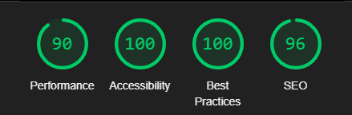

# The Escapists
(Developer: Christopher Jimerson)

[Live Site](https://cmjimerson1s.github.io/ci_pp1_erbusiness/) 

## Table of Content

1. [Project Goals](#project-goals)
    1. [User Goals](#user-goals)
    2. [Site Owner Goals](#site-owner-goals)
2. [User Experience](#user-experience)
    1. [Target Audience](#target-audience)
    2. [User Requrements and Expectations](#user-requrements-and-expectations)
    3. [User Stories](#user-stories)
3. [Design](#design)
    1. [Design Choices](#design-choices)
    2. [Colour](#colours)
    3. [Fonts](#fonts)
    4. [Structure](#structure)
    5. [Wireframes](#wireframes)
4. [Technologies Used](#technologies-used)
    1. [Languages](#languages)
    2. [Frameworks & Tools](#frameworks-&-tools)
5. [Features](#features)
6. [Testing](#validation)
    1. [HTML Validation](#HTML-validation)
    2. [CSS Validation](#CSS-validation)
    3. [Accessibility Validation](#accessibility-validation)
    4. [Performance](#performance)
    5. [Device testing](#performing-tests-on-various-devices)
    6. [Browser compatibility](#browser-compatability)
    7. [Testing user stories](#testing-user-stories)
8. [Bugs](#Bugs)
9. [Deployment](#deployment)
10. [Credits](#credits)
11. [Acknowledgements](#acknowledgements)

## Project Goals 

### User Goals
-Find a fun place to participate in a team building activity
 
-Learn about the different games and difficulties
 
-Find information about the business location and staff
 
-Be able to request a date and time for an event

### Site Owner Goals
-Educate site visitors on what an escape room is
 
-Give operating hours and location so customers may visit business
 
-Show the games the business has designed
 
-Allow interested parties to request booking

## User Experience

### Target Audience
-Corporations looking for team building activities
 
-Private persons looking for a fun event
 
-Enthusiasts of the Escape Room industry

### User Requrements and Expectations
-Ease in requesting event date and time
 
-Explanation of the theme of the different rooms
 
-Consistent navigation through the site
 
-Multiple opportunities to navigate to booking form
 
-Accessibility and easy to consume content
 
-Images and design that entices or evokes fun

### User Stories

1. As Janice, I want to know what an escape room, is so I can decide if I want to try it	
2. As Steven, I want to know where you're located, so I can plan my night out with my friends in a better way	
3. As Oskar, I want to know what rooms you have,	so I can pick the best theme for my birthday party	
4. As Leo,	I want to be able to book your rooms, so	I can have a fun event	
5. As Adam, I want to know the story of the rooms, 	so I can choose the most fun room to me	
6. As Ryan, I want to how and when I can contact you, so I can adjust my event if I need to	
7. As an enthusiast, I want to understand who is apart of the company, so I can support other endeavors by the creators	    
8. As a manager, I want to	know if this activity is good for my team,	so I can plan a fun team building activity	
9. As a gamer, I want to how difficult the rooms are	so, I can give myself the greatest challenge	
10. As a happy customer, I want to review your business, so	I can tell people what a fun time I had	

## Design

### Design Choices
The website is designed with engaging photos and a fun color scheme to try and evoke the feeling of excitement or adventure, while also drawing attention to the element of time constraints that are present in the base gameplay of the escape room experience. 

### Colour
The color choice is predominantly orange, with accents of black and white. Orange is a warm color that is associated with excitement, adventure, sunshine, and fun. It evokes a sense of high energy and invigoration that meets the pace that the escape room game usually has. It’s also contemplative, and shares in the need for thought and logic in solving the puzzle.

### Fonts
Bold uppercase font Staatliches is used for the titles, and logo. It leans into the modern nature of the escape room games, as it’s a new entertainment industry while also being striking against the font Raleway. Raleway makes up the bulk of the content, which is a font that is simplistic in it's design but still stylistic.

### Structure
The structure of the website is reminiscent of many other layouts allowing for innate intuitive traversal across the five pages that make up the site. Each page has the company logo, navigation links, and a footer that are identical and shared across all pages to allow cohesion to the user experience. The pages are as follows, following from the left to the right across the navigation bar…
 
-Home: A homepage with a section defining escape rooms and listing reasons the user should choose the business. 
 
-About: A page that names the C-Suite of the company, with accompanied photos of the individuals.
 
-Rooms: This page shows the three rooms the business has to offer, along with a description of each, and a difficulty level. 
 
-Contact: A page containing important operating information such as operating hours, phone, email, and business location with a Google Map pin. 
 
-Book Now: This is a form that allows customers to request a time and date for a booking as well as which rooms they would like to reserve.

### Wireframes

## Technology Used

### Languages
-HTML
 
-CSS

### Frameworks and Tools
-GitPod
 
-GitHub
 
-Font Awesome
 
-Google Fonts
 
-Google Maps
 
-Favicon

## Features
The site contains five pages and eleven features, as follow:

### Logo and Nav
Has titles for all 5 pages listed
 
It runs horizontal across the middle of the pages and is easy to use and navigate

### What is… definitions
Helps define what an escape room is
 
Clarifies for customers who are unaware the additional benefits of the room
 
User stories covered: 1

	
### Reasons for Bookings
The list helps outline why an escape room game is perfect for a variety of individuals
 
The lists acts like an arrow for different browsers drawing attention to the call to action book now button
 
User stories covered: 8

		
### Book Now buttons
These buttons are in a few locations across the site offering multiple opportunities for customers to book, hopefully to increase conversion
 
User stories covered: 4

		
### List of Staff
The list provides a view of the individuals paramount to the operations of the business
 
User stories covered: 7

### Rooms List
These cards highlight the theme, the story, and the difficulty of the room while also allowing customers to be taken straight to the booking form
 
User stories covered: 3

		
### Difficulty Listings
These are visible and listed above the images so ensure visibility and to help players choose the correct rooms for their event
 
User stories covered: 9

	
### Business Information
The operation hours show the days the business is operating, and the times. The phone number and email are visible as well, with the business address above the pinned map.
 
User stories covered: 6

		
### Google Maps
Interactive map that allows a customer to see the location of the business and navigate the Google Maps snippet
 
User stories covered: 2

		
### Booking Request Form
This allows the customer to make a booking, the contact pages shows the times and dates that are available to the customer
 
User stories covered: 4

### Footer
The footer is shared across all pages and has links to the social media pages of the business, including facebook and google which are the main review platforms for many escape rooms.
 
User stories covered: 10

## Validation

### HTML Validation
Utilizing W3C HTML Validation, (link) all pages pass with no errors

Home

    

About

    

Rooms

    

Contact

    

Book Now!

    

    
### CSS Validation
Utilizing W3C Jigsaw CSS Validation, the whole CSS file passed without errors or warnings

Validation style.css

### Accessibility Validation
WAVE WebAIM was used to evaluate the accessibility of the website and every page passed with 0 errors and 0 contrast errors

Home

    

About

    

Rooms

    

Contact

    

Book Now!

    

### Performance
Utilizing Google Lighthouse through the Google Chrome Developer toolset all pages were tested for performance, with every page succeeding in a rating of over 90 for every category.

Home

    

About

    

Rooms

    

Contact

    

Book Now!

    

### Performing tests on various devices 
The website was testing on the following devices

Samsung S10
Iphone 8
Samsung S22
Galaxy Tab
Lenovo Legion 16.9 inch Laptop

The site was also tested using the many emulated devices through the use of Google Chrome Developer Tools

### Browser compatability
The website was evaluated and tested on the following browswers below:

Mozilla Firefox
Chrome
Microsoft Edge

### Testing user stories

1. As Janice, I want to know what an escape room, is so I can decide if I want to try it	

| **Feature** | **Action** | **Expected Result** | **Actual Result** |
|-------------|------------|---------------------|-------------------|
|  |  |  |  |
|  |  |  |  |

2. As Steven, I want to know where you're located, so I can plan my night out with my friends in a better way	

| **Feature** | **Action** | **Expected Result** | **Actual Result** |
|-------------|------------|---------------------|-------------------|
|  |  |  |  |
|  |  |  |  |

3. As Oskar, I want to know what rooms you have, so I can pick the best theme for my birthday party	

| **Feature** | **Action** | **Expected Result** | **Actual Result** |
|-------------|------------|---------------------|-------------------|
|  |  |  |  |
|  |  |  |  |

4. As Leo,	I want to be able to book your rooms, so I can have a fun event	

| **Feature** | **Action** | **Expected Result** | **Actual Result** |
|-------------|------------|---------------------|-------------------|
|  |  |  |  |
|  |  |  |  |

5. As Adam, I want to know the story of the rooms, 	so I can choose the most fun room to me	

| **Feature** | **Action** | **Expected Result** | **Actual Result** |
|-------------|------------|---------------------|-------------------|
|  |  |  |  |
|  |  |  |  |

6. As Ryan, I want to how and when I can contact you, so I can adjust my event if I need to	

| **Feature** | **Action** | **Expected Result** | **Actual Result** |
|-------------|------------|---------------------|-------------------|
|  |  |  |  |
|  |  |  |  |

7. As an enthusiast, I want to understand who is apart of the company, so I can support other endeavors by the creators	

| **Feature** | **Action** | **Expected Result** | **Actual Result** |
|-------------|------------|---------------------|-------------------|
|  |  |  |  |
|  |  |  |  |

8. As a manager, I want to	know if this activity is good for my team,	so I can plan a fun team building activity	

| **Feature** | **Action** | **Expected Result** | **Actual Result** |
|-------------|------------|---------------------|-------------------|
|  |  |  |  |
|  |  |  |  |

9. As a gamer, I want to how difficult the rooms are	so, I can give myself the greatest challenge	

| **Feature** | **Action** | **Expected Result** | **Actual Result** |
|-------------|------------|---------------------|-------------------|
|  |  |  |  |
|  |  |  |  |

10. As a happy customer, I want to review your business, so	I can tell people what a fun time I had	

| **Feature** | **Action** | **Expected Result** | **Actual Result** |
|-------------|------------|---------------------|-------------------|
|  |  |  |  |
|  |  |  |  |

## Bugs

## Deployment

The website was deployed using GitHub Pages by following these steps:
1. In the GitHub repository navigate to the Settings tab
2. On the left hand menu select Pages
3. For the source select Branch: master
4. After the webpage refreshes automaticaly you will se a ribbon on the top saying: "Your site is published at https://cmjimerson1s.github.io/ci_pp1_erbusiness/"

## Credits

### Media

[hero_image_small](assets/images/hero_image_small_size.jpg): Photo by <a href="https://www.pexels.com/@giallo/">Giallo</a> on <a href="https://www.pexels.com/photo/assorted-silver-colored-pocket-watch-lot-selective-focus-photo-859895/">Pexels</a>
[ceo_profile_pic](assets/images/ceo_profile_pic_small.jpg): Photo by <a href="https://www.pexels.com/@emmy-e-1252107/">Emmy E</a> on <a href="https://www.pexels.com/photo/woman-wearing-gray-notch-lapel-suit-jacket-2381069/">Pexels</a>
[cmo_profile_pic](assets/images/cmo_profile_pic_small.jpg): Photo by <a href="https://www.pexels.com/@imalimadad/">Ali Madad Sakhirani</a> on <a href="https://www.pexels.com/photo/man-wearing-black-notched-lapel-suit-jacket-997512/">Pexels</a>
[cto_profile_pic](assets/images/cto_profile_pic_small.jpg) Photo by <a href="https://www.pexels.com/@olly/">Andrea Piacquadio</a> on 
[pirate](assets/images/pirate.jpg) Photo by <a href="https://pixabay.com/users/mastertux-470906/">MasterTux</a> on <a href="https://pixabay.com/photos/adventure-treasure-map-old-world-map-2528477/">Pixabay</a>
[zombie](assets/images/zombie.jpg) Photo by <a href="https://www.pexels.com/@cottonbro/">CottonBro</a> on <a href="https://www.pexels.com/photo/zombies-behind-shabby-door-5435562/">Pexels</a>
[alien](assets/images/alien.jpg) Photo by <a href="https://pixabay.com/users/pawel86-4538278/">Pawel86</a> on <a href="https://pixabay.com/photos/ufo-alien-guy-pozaziemianin-2413965/">Pixabay</a>
[puzzle_background_small](assets/images/puzzle_background_small.jpg): Photo by <a href="https://unsplash.com/@melpoole">Mel Poole</a> on <a href="https://unsplash.com/photos/eo5Hrzyb4D0">Unsplash</a>

### Code

-The Google Maps code snippet was provided by the service https://www.embed-map.com/ 

